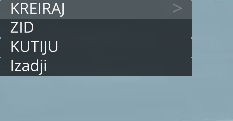
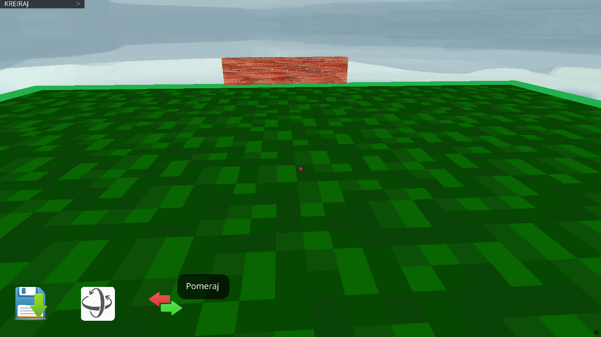
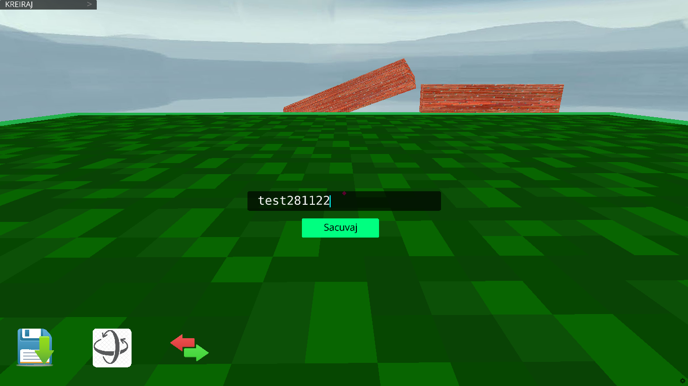
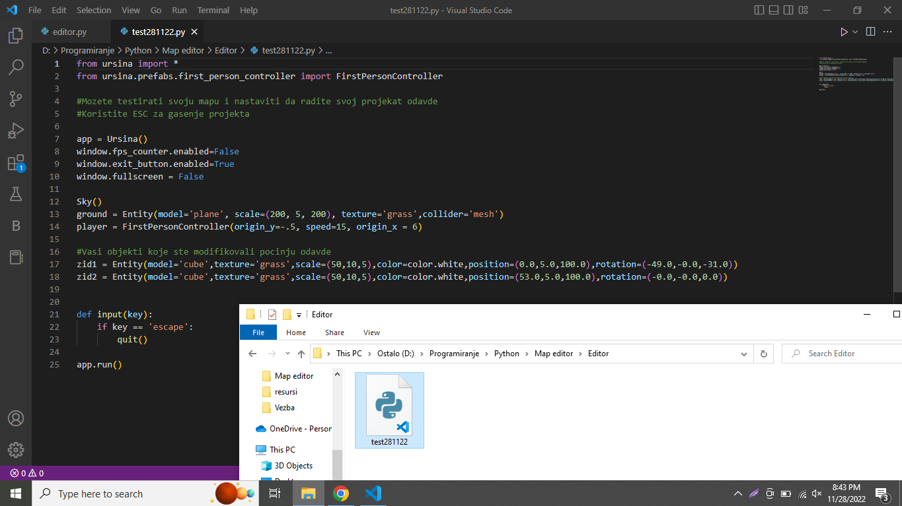

# Python-3D-Map-Editor

This is Python game made with Ursina, with this game you can make
your own map for 3D Python games make with Ursina, you can
create walls and boxes for now and change positions of them and when you finish with editing you can save your work and you will
get new file in Editor folder. 

You need to change code on line 75: cuvanje = f'D:\Programiranje\Python\Map editor\Editor\\{Save_field.text}.py' here you need to put your directory.

